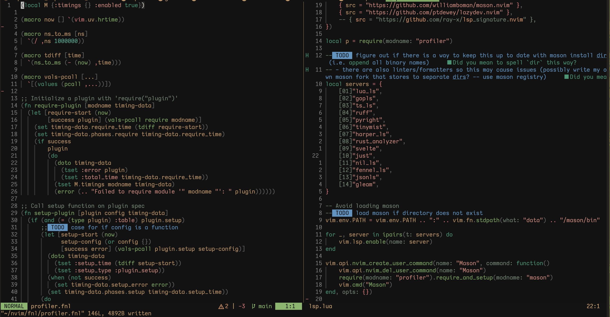

<h1 align="center">Vitesse</h1>

<p align="center">
    
</p>

Port of the [Vitesse VSCode theme](https://github.com/antfu/vscode-theme-vitesse)

## Installation

With `vim.pack`:

```lua
vim.pack.add({ "https://codeberg.org/pdewey/vitesse-nvim" })
vim.cmd.colorscheme("vitesse")
```

With `lazy.nvim`:

```lua
{
    "https://codeberg.org/pdewey/vitesse-nvim",
    priority = 1000,
},
```

## Build or Modify

1. [fennel](https://github.com/bakpakin/Fennel) or [hotpot.nvim](https://github.com/rktjmp/hotpot.nvim/tree/main) is installed
2. Modify [fnl/vitesse/init.fnl](fnl/vitesse/init.fnl) as desired
3. Rebuild the colorscheme
   - With `fennel`: Use `./build.sh` or `just build`
   - With `hotpot.nvim`: Builds are automatic upon saving `fnl/vitesse/init.fnl`
